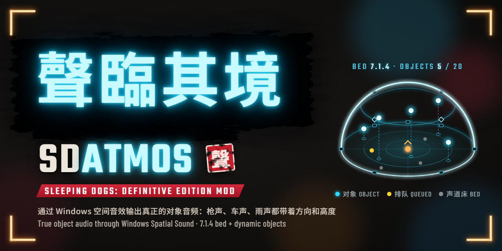
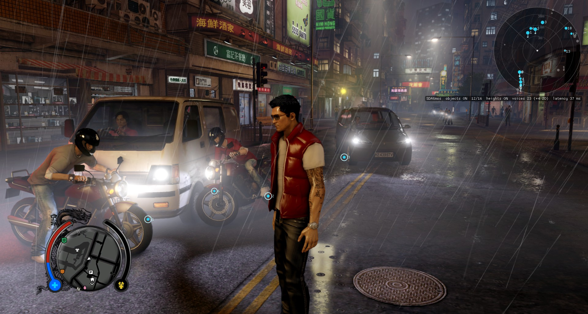
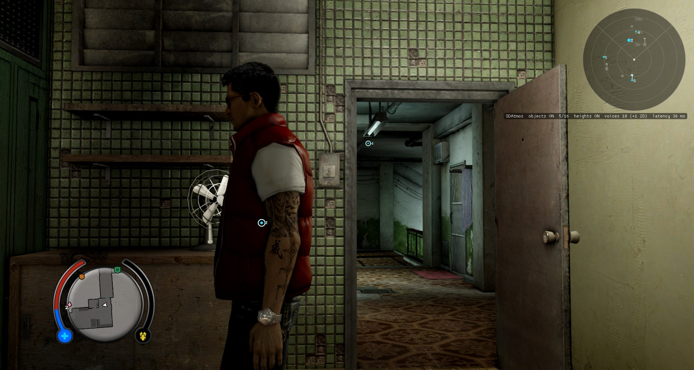
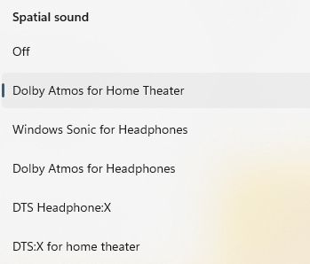

# Sleeping Dogs: Definitive Edition — object-based audio output (SDAtmos)





雨夜街头：摩托车和汽车的引擎各自是一个对象，雷达上的对象分布在四周。<br>
A rainy street at night: the motorbike and car engines are separate objects, spread all around on the radar.



同一平面和不同高度的对象：对象 2 大致与听者同高，对象 4 在门口上方的天花板灯处。<br>
Same plane and a different height: object 2 is at about the listener's height, object 4 at the ceiling light above the doorway.

[中文](#中文) | [English](#english)

## 中文

让《热血无赖：终极版》输出真正的**空间音频**：接全景声回音壁或功放时，显示的不再是 Dolby Audio，而是
**Dolby Atmos**；戴耳机时，Windows 的耳机空间音效也能拿到每个声音的真实方向。

- 枪声、脚步、车辆、人声这些声音会从它们在游戏里的真实方向传来，包括上方和下方；
- 雨声、雷声、风声、鸟叫和环境回响有一部分会从头顶传来；
- 游戏原本的混音不变，只是每个声音的位置更准了。

状态：**实验性**。在作者的环境里（HDMI 连接的全景声回音壁）工作正常。

> 适用于 **Steam 版的当前版本**，Windows 10/11 64 位。其他版本没有测试过；如果 mod 认不出你的游戏版本，它会
> 自动不生效，游戏声音和原来一样。想了解原理、自己编译，或已经装过其他 mod，请看 [ADVANCED.md](ADVANCED.md)。

### 你需要什么

**Windows 的「空间音效」必须打开**，也就是不能是默认的「关」。这是最重要的一步：空间音效关着的时候，mod
什么都不做，游戏照常用原来的声音输出（不会出问题，只是没有效果）。

根据你用的设备选一种：

- **全景声回音壁或功放**（用 HDMI 接到电脑上）：选 “Dolby Atmos for Home Theater”（需要 Microsoft Store 里的
  免费应用 Dolby Access），或者 DTS:X 设备选 “DTS:X for home theater”；
- **耳机**：选 “Windows Sonic for Headphones”（Windows 自带，免费），或者 “Dolby Atmos for Headphones”、
  “DTS Headphone:X”（需要各自的应用）。

### 安装（大约五分钟）

**第 1 步：打开 Windows 的空间音效（一定要做）**

1. 用 Dolby 或 DTS 的格式的话，先在 Microsoft Store 里安装对应的应用（Dolby Access 或 DTS Sound Unbound），
   打开它并按提示设置好你的设备。用 Windows Sonic 的话跳过这一步。
2. 打开「设置」→「系统」→「声音」，点你正在用的输出设备（回音壁/功放通常显示为它的名字，或 “HDMI”
   “Display Audio”；耳机就点耳机）。
3. 找到「空间音效」（Spatial sound），把它从「关」（Off）改成下图中**除了「关」以外的任意一项**：

   

   你的列表可能比图里短，只会列出这台设备支持、并且已经装了对应应用的格式。
4. 确认这个设备是默认输出设备（「声音」页面最上面选中的那个）。

**第 2 步：下载**

点这里下载 **[SDAtmos.zip](https://github.com/aUsernameWoW/sleeping-dogs-object-based-audio-output/releases/latest/download/SDAtmos.zip)**。
也可以在 [Nexus Mods](https://www.nexusmods.com/sleepingdogsdefinitiveedition/mods/173?tab=files) 的 Files
页面下载，内容相同。

压缩包里只有这些：

```text
dinput8.dll                  ← Ultimate ASI Loader：让游戏加载 mod 的“加载器”
plugins\
    SDAtmos.asi              ← mod 本体
    SDAtmos-THIRD-PARTY-NOTICES.md
```

**第 3 步：打开游戏文件夹**

1. 打开 Steam，进入「库」。
2. 在左侧列表里右键点「Sleeping Dogs: Definitive Edition」→「管理」→「浏览本地文件」。
3. 弹出来的就是游戏文件夹，里面有 `sdhdship.exe`（如果电脑不显示扩展名，就是一个叫 `sdhdship` 的程序）。

**第 4 步：把文件放进去**

1. 双击打开下载的 `SDAtmos.zip`。
2. 选中里面的 `dinput8.dll` 和 `plugins` 文件夹，一起拖进游戏文件夹。
3. 如果 Windows 弹出「替换或跳过文件」，说明游戏文件夹里已经有 `dinput8.dll` 了（你以前装过别的 mod，
   加载器已经在了），选「跳过该文件」。已有的 `plugins` 文件夹会自动合并，不用管。

放好后，游戏文件夹里应该是这样（只列出相关的部分）：

```text
SleepingDogsDefinitiveEdition\
    sdhdship.exe
    dinput8.dll
    plugins\
        SDAtmos.asi
```

注意 `dinput8.dll` 要和 `sdhdship.exe` 在同一层，不要多套一层文件夹。

**第 5 步：启动游戏，确认生效**

照常从 Steam 启动游戏。

- 用回音壁/功放的话，进入游戏后它的显示屏或指示灯应该显示 **Dolby Atmos**（或 DTS:X）；
- 用耳机的话，打开游戏文件夹里的 `plugins\SDAtmos.log`，里面有一行 `spatial: stream started on ...`，就说明
  已经在用空间音效输出了。

另外，`plugins` 里多出 `SDAtmos.ini` 和 `SDAtmos.log` 两个文件，说明 mod 已经加载。

### 游戏里的按键

- **F9**：开关“声音对象”。按一下听原来的声音，再按一下切回来，方便对比。
- **F7**：开关头顶声道（雨声、环境声抬到上方的那部分），同样用来对比。
- **F8**：显示声音雷达和画面上的声音标记，就是上面截图里的样子（需要 ReShade，见下面）。

### 常见问题

**回音壁还是显示 Dolby Audio 或 PCM，不显示 Dolby Atmos；或者日志里没有 “stream started”**

- 回到第 1 步，确认「空间音效」不是「关」（回音壁/功放要选 “Dolby Atmos for Home Theater” 才会显示 Atmos），
  而且这个设备是**默认**输出设备；
- 打开 `plugins\SDAtmos.log`，如果里面有 “has no spatial audio”，说明 Windows 对这个设备没有开空间音效；
- 如果 `plugins` 里根本没有 `SDAtmos.log`，说明 mod 没被加载：检查 `dinput8.dll` 是否和 `sdhdship.exe`
  在同一层，杀毒软件有没有删掉它（ASI 加载器偶尔会被误报，可以从隔离区还原并把游戏文件夹加入排除项）；
  如果第 4 步跳过了原有的 `dinput8.dll`，那个文件可能不是 ASI 加载器，备份后换成压缩包里的。

**日志里有 “MISSING”**

mod 认不出你的游戏版本，这部分功能没有启用，游戏声音不受影响。请把日志发给作者（见下面）。

**想用 F8 雷达，或者在游戏里调设置**

需要安装带完整插件支持的 ReShade（安装包名字里有 “Addon”），目前只支持 **ReShade 6.8.0**。装好后按 Home
打开 ReShade，里面有 **SDAtmos** 标签页，可以实时调整设置并保存。不装 ReShade 时声音部分照常工作。

**想改设置**

用记事本打开 `plugins\SDAtmos.ini`，改完保存，重启游戏。每一项都有中文说明。

**更新**

下载新的 `SDAtmos.zip`，只把里面的 `plugins` 文件夹拖进游戏文件夹，Windows 询问时选「替换目标中的文件」。
`SDAtmos.ini` 不在压缩包里，你的设置会保留。

**卸载**

删掉 `plugins` 里的 `SDAtmos.asi`、`SDAtmos.ini` 和 `SDAtmos.log`。如果 `plugins` 里已经没有其他 `.asi`
文件了，`dinput8.dll` 也可以删掉。

**遇到问题怎么反馈**

在 [GitHub Issues](https://github.com/aUsernameWoW/sleeping-dogs-object-based-audio-output/issues) 或 Nexus
Mods 页面的 Bugs 标签里说明情况（用的什么回音壁/功放/耳机、哪种空间音效），并附上 `plugins\SDAtmos.log`。

与 Square Enix、United Front Games、Audiokinetic、Dolby、DTS、Microsoft 均无关联。

## English

Makes Sleeping Dogs: Definitive Edition output real **spatial audio**: an Atmos soundbar or receiver shows
**Dolby Atmos** instead of Dolby Audio, and Windows' headphone spatial sound gets each sound's real direction.

- Gunshots, footsteps, vehicles and voices come from where they are in the game, above and below included;
- part of the rain, thunder, wind, birds and room reverb comes from overhead;
- the game's own mix stays the same; each sound is just placed more precisely.

Status: **experimental**. It works on the author's setup (an Atmos soundbar over HDMI).

> For the **current Steam version**, Windows 10/11 64-bit. Other versions are untested; if the mod doesn't
> recognize your game version it turns itself off and the game sounds as before. For how it works, building it,
> or adding it to an existing mod setup, see [ADVANCED.md](ADVANCED.md).

### What you need

**Windows "Spatial sound" must be turned on**, i.e. not left at its default, Off. This is the most important
step: with spatial sound off, the mod does nothing and the game uses its normal audio output (nothing
breaks, there's just no effect).

Pick one for your device:

- **An Atmos soundbar or receiver** (connected over HDMI): "Dolby Atmos for Home Theater" (needs the free
  Dolby Access app from the Microsoft Store), or "DTS:X for home theater" for a DTS:X device;
- **Headphones**: "Windows Sonic for Headphones" (built into Windows, free), or "Dolby Atmos for Headphones" /
  "DTS Headphone:X" (each needs its app).

### Installing (about five minutes)

**Step 1: turn on Windows spatial sound (don't skip this)**

1. For a Dolby or DTS format, first install its app from the Microsoft Store (Dolby Access or DTS Sound
   Unbound), open it and follow its setup for your device. For Windows Sonic, skip this.
2. Open Settings → System → Sound and click the output device you use (a soundbar/receiver shows by its name,
   or as "HDMI" / "Display Audio"; for headphones, click the headphones).
3. Find "Spatial sound" and change it from Off to **anything in this list except Off**:

   

   Your list may be shorter: it only shows formats the device supports and whose app is installed.
4. Make sure the device is the default output device (the one selected at the top of the Sound page).

**Step 2: download**

Download **[SDAtmos.zip](https://github.com/aUsernameWoW/sleeping-dogs-object-based-audio-output/releases/latest/download/SDAtmos.zip)**.
The Files tab on [Nexus Mods](https://www.nexusmods.com/sleepingdogsdefinitiveedition/mods/173?tab=files) has
the same thing.

The zip holds only this:

```text
dinput8.dll                  ← Ultimate ASI Loader: the "loader" that makes the game load mods
plugins\
    SDAtmos.asi              ← the mod itself
    SDAtmos-THIRD-PARTY-NOTICES.md
```

**Step 3: open the game folder**

1. Open Steam and go to your Library.
2. Right-click "Sleeping Dogs: Definitive Edition" in the list on the left → Manage → Browse local files.
3. The folder that opens is the game folder. It contains `sdhdship.exe` (shown as just `sdhdship` if
   Windows hides file extensions).

**Step 4: copy the files in**

1. Double-click the downloaded `SDAtmos.zip` to open it.
2. Select `dinput8.dll` and the `plugins` folder inside and drag both into the game folder.
3. If Windows shows "Replace or Skip Files", the game folder already has a `dinput8.dll` (you already have a
   loader from another mod): choose "Skip this file". An existing `plugins` folder is merged automatically.

Afterwards the game folder should look like this (only the relevant parts):

```text
SleepingDogsDefinitiveEdition\
    sdhdship.exe
    dinput8.dll
    plugins\
        SDAtmos.asi
```

`dinput8.dll` has to sit next to `sdhdship.exe`, without an extra folder level.

**Step 5: start the game and check**

Start the game from Steam as usual.

- With a soundbar/receiver, its display or lights should show **Dolby Atmos** (or DTS:X) once you're in the
  game;
- with headphones, open `plugins\SDAtmos.log` in the game folder: a line `spatial: stream started on ...`
  means the game is playing through spatial sound.

The `plugins` folder also gets `SDAtmos.ini` and `SDAtmos.log`, which shows the mod was loaded.

### Keys in game

- **F9**: sound objects on/off. Press it to hear the original sound, press again to switch back.
- **F7**: overhead channels on/off (the rain and ambience lifted overhead), also for comparing.
- **F8**: the sound radar and on-screen markers from the screenshots above (needs ReShade, see below).

### FAQ

**The soundbar still shows Dolby Audio or PCM, not Dolby Atmos; or the log has no "stream started"**

- Go back to step 1: Spatial sound must not be Off (a soundbar/receiver needs "Dolby Atmos for Home Theater" to
  show Atmos), and the device must be the **default** output device;
- if `plugins\SDAtmos.log` contains "has no spatial audio", Windows has no spatial sound on for that device;
- if there is no `SDAtmos.log` in `plugins` at all, the mod wasn't loaded: check that `dinput8.dll` is next to
  `sdhdship.exe` and that your antivirus didn't remove it (ASI loaders are sometimes flagged by mistake;
  restore it from quarantine and exclude the game folder). If you skipped an existing `dinput8.dll` in step 4,
  that file may not be an ASI loader; move it somewhere safe and use the one from the zip.

**The log says "MISSING"**

The mod doesn't recognize your game version, so that part stays off and the game's sound is unaffected. Please
send the log to the author (see below).

**Using the F8 radar or changing settings in game**

You need ReShade with full add-on support (the installer with "Addon" in its name), and currently only
**ReShade 6.8.0** works. Press Home to open ReShade; its **SDAtmos** tab has live settings and can save them.
Without ReShade the audio part works all the same.

**Changing settings**

Open `plugins\SDAtmos.ini` in Notepad, save your changes and restart the game. Every setting is explained in
the file.

**Updating**

Download the new `SDAtmos.zip` and drag only its `plugins` folder into the game folder; when Windows asks,
choose "Replace the files in the destination". `SDAtmos.ini` isn't in the zip, so your settings stay.

**Uninstalling**

Delete `SDAtmos.asi`, `SDAtmos.ini` and `SDAtmos.log` from `plugins`. If no other `.asi` files are left in
`plugins`, you can delete `dinput8.dll` too.

**Reporting a problem**

Describe it in [GitHub Issues](https://github.com/aUsernameWoW/sleeping-dogs-object-based-audio-output/issues)
or on the Bugs tab of the Nexus Mods page (which soundbar/receiver/headphones, which spatial sound format), and attach
`plugins\SDAtmos.log`.

Not affiliated with Square Enix, United Front Games, Audiokinetic, Dolby, DTS or Microsoft.
